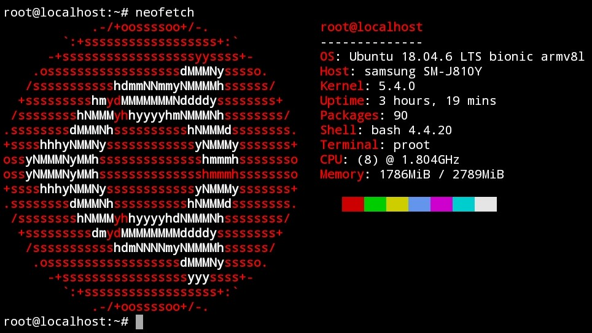

## Ubuntu 18.04 (Bionic Beaver) in Termux

## Installation
Copy and paste this command into Termux:
```
curl --silent --location --remote-name https://raw.githubusercontent.com/trungtai33/ubuntu-bionic-in-termux/master/install.sh; bash install.sh; rm install.sh
```
After installation, run ```start-ubuntu-bionic``` to login.
## Uninstall
Be careful when using this command as it does not ask for confirmation.
```
curl --silent --location --remote-name https://raw.githubusercontent.com/trungtai33/ubuntu-bionic-in-termux/master/uninstall.sh; bash uninstall.sh; rm uninstall.sh
```
